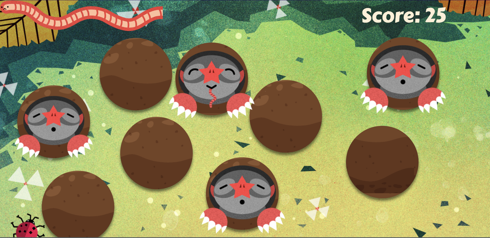

# Feed-a-mole

A simple feed-a-mole game built with html, css and javascript. The game is adapted from [frontend masters bootcamp](https://frontendmasters.github.io/bootcamp/mole).

## Improvements over the original game:

<ins>Mole hole generation</ins>

Moleholes are generated at random locations, instead of a pre-defined grid as in the original version. The holes do not intersect with each other and are populated based on the viewport dimensions.

<ins>Scoring</ins>
* Score decreases if the moles are not fed in time. Scores decrease by half the points as the score gains upon sucessful feeding.
* Scores also displayed in numerical format.

<ins>Appearance changes</ins>
* The mole holes have soil textures.
* Moles 'zoom' in and out, as they appear and dissappear respectively to give a more smoother transition.
